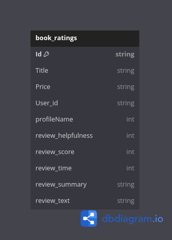
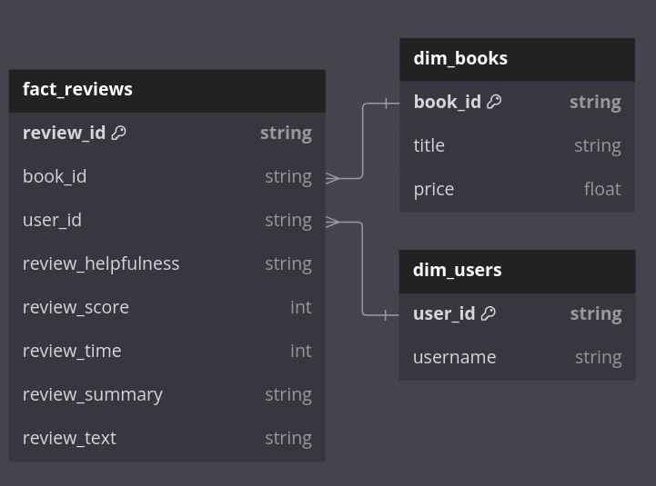
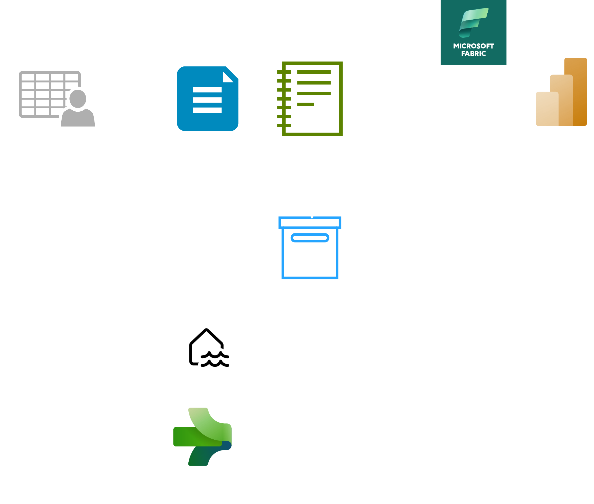
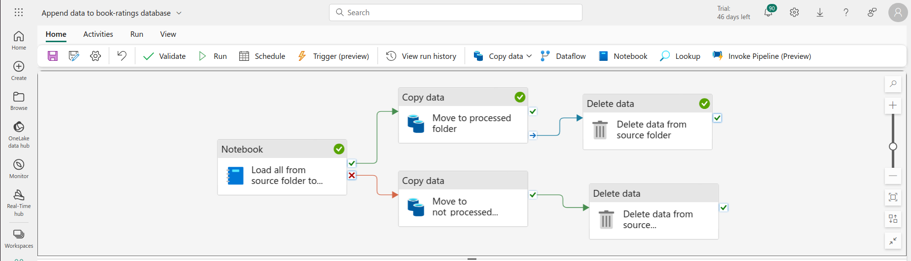

## Project Overview
This project automates the process of:
1. creating a relational database from a book-ratings.csv file, 
2. and appending new records to the new db on a daily basis.

Raw file looks like this:\

And we'll be creating a star-schema database like this:\

## Tech Stack
Entire project was done using Microsoft Fabric*:

- **Storage**
  - Lakehouse
- **Processing**
  - Notebook (Pyspark)
- **Orchestration**
  - Data Pipeline

*Microsoft is heavily investing in Fabric, and eventually most companies using Azure will have to migrate their pipelines to this one-stop-shop (or, at least, create new pipelines there).

## Architecture

## Fabric Data Pipeline
\
*had some issues with running "Delete data" task. That's why I created two separate "Delete data" tasks.

## Notebook
We're doing these transformations in the notebook:
1. Change column's CamelCase to snake_case
2. Rename columns
3. Add `review_id` & `price_category` column
4. Apply schema
5. Drop duplicates (records with the same `book_id` and `user_id`)

Notebook also has a logic to a) create a table if it doesn't exist, or b) append to a table if it already exists.

Full notebook available in the `./notebooks/` folder.

## Concepts Implemented
- **Star schema**: I split the book-ratings.csv into a fact table (`fact_reviews`) and two dimension tables (`dim_users`, `dim_books`). Star schema helps with database normalization. This reduces duplicates, and makes querying more efficient.

## Usage/Testing
- To test this notebook and verify how it treats appends, you may use `./sample_data` which I prepared.

## Contact
For any questions or inquiries, please contact me at bernasiakk@gmail.com

Thanks for reading!